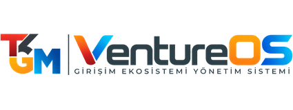
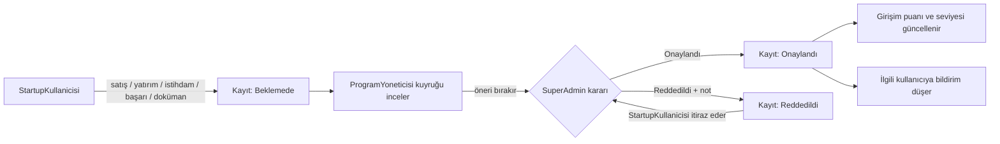
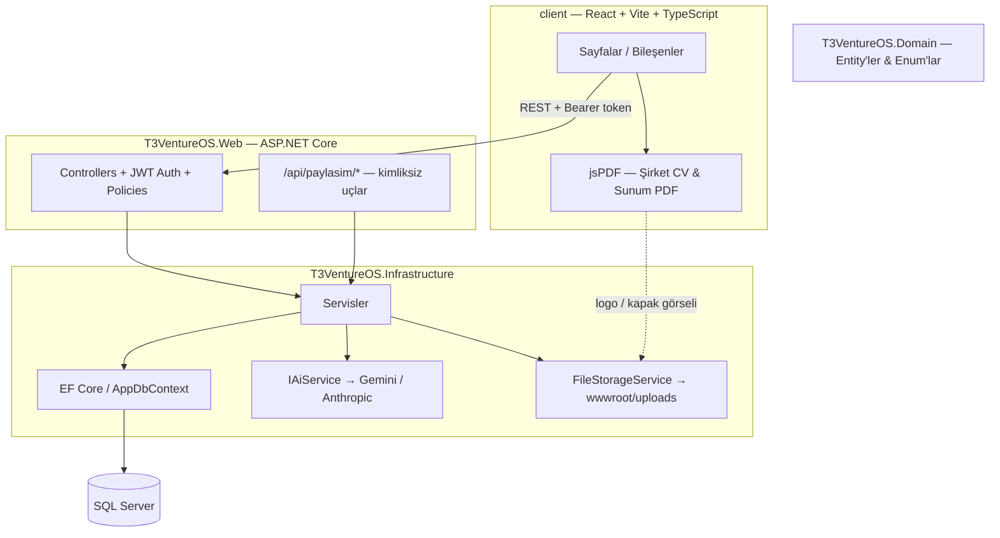

<div align="center">

<picture>
  <source media="(prefers-color-scheme: dark)" srcset="client/public/logo-tam.png">
  <source media="(prefers-color-scheme: light)" srcset="client/public/logo-tam-koyu.png">
  
</picture>

# T3VentureOS

### T3 Vakfı girişimcilik ekosistemi için uçtan uca değerlendirme, onay ve raporlama platformu

<p>
  
  
  
  
  
  
  
  
  
</p>

**T3VentureOS**, T3 Vakfı'nın hızlandırma programlarına katılan girişimleri; satış, yatırım, istihdam ve
başarı kayıtları üzerinden merkezi olarak izleyen; onay/itiraz süreçlerini işleten ve AI destekli
analiz/raporlama sunan, çok kiracılı **olmayan** kurumsal bir platformdur.

</div>

---

## İçindekiler

- [Proje Hakkında](#proje-hakkında)
- [Roller ve Yetkiler](#roller-ve-yetkiler)
- [Onay Akışı Nasıl Çalışır?](#onay-akışı-nasıl-çalışır)
- [Öne Çıkan Özellikler](#öne-çıkan-özellikler)
- [Teknik Mimari](#teknik-mimari)
- [Teknoloji Yığını](#teknoloji-yığını)
- [Proje Yapısı](#proje-yapısı)
- [Hızlı Başlangıç](#hızlı-başlangıç)
- [Test](#test)
- [Güvenlik](#güvenlik)
- [Geliştirme Hesapları](#geliştirme-hesapları)
- [Dallar ve Sürümler](#dallar-ve-sürümler)
- [Bilinen Eksikler](#bilinen-eksikler)
- [Detaylı Dokümantasyon](#detaylı-dokümantasyon)
- [Ekip](#ekip)

---

## Proje Hakkında

Bir hızlandırma programı; onlarca girişimin ilerleyişini, ciro/yatırım/istihdam verisini ve program
etkisini tek tek e-postalar, Excel dosyaları ve toplantı notlarıyla takip etmeye çalıştığında hızla
dağılır. Kim hangi kaydı ne zaman onayladı, bir girişim programa hangi aşamada girdi, hangi program
gerçekten ciro/yatırım/istihdam üretti — bu sorular manuel süreçte cevapsız kalır.

T3VentureOS bu takibi tek bir sistemde toplar:

- Girişimler kendi verilerini (satış, yatırım, istihdam, başarı, doküman) sisteme girer.
- Program yöneticileri kuyruğu inceler ve onay/ret **önerisi** bırakır — nihai karar SuperAdmin'de
  toplanır, tek bir onay hattı ve tek bir sorumluluk noktası vardır.
- Reddedilen bir kayıt için girişim itiraz açabilir; itiraz kabul edilirse kayıt tekrar onaylı hale döner.
- Girişimin puanı (0-100) ve seviyesi (Bronz/Gümüş/Altın/Platin) profil tamlığı ve kayıt derinliğinden
  otomatik hesaplanır — girişimciye somut "puanını yükseltmek için ne yapmalı" adımları gösterilir.
- Google Gemini destekli analiz katmanı; ekosistem, rakip, tekil girişim ve program-etkisi düzeyinde
  otomatik yorum üretir — her yorum "veri yoksa bunu açıkça söyle" ilkesiyle temkinli yazılır.

## Roller ve Yetkiler

Sistem üç role dayanır; karar (onay/ret) yetkisi **tek bir yerde**, SuperAdmin'de toplanır:

| Rol | Kapsam | Yetkiler |
|-----|--------|----------|
| **SuperAdmin** | Sistem geneli | Tüm girişim/program/kullanıcı yönetimi, **tüm onay/red kararları**, kullanıcı davet/devre dışı bırakma, işlem geçmişi (audit log) |
| **ProgramYoneticisi** | Programlar + girişimler | Hızlandırma programı oluşturur, girişim ekler/düzenler, onay kuyruğunu inceler ve öneri bırakır (karar yetkisi yoktur) |
| **StartupKullanicisi** | Yalnızca kendi girişimi | Kendi profilini günceller, satış/yatırım/istihdam/başarı/doküman/gelişim adımı girer, itiraz açar, sunum ve şirket CV'si üretir/paylaşır |

> Yetkilendirme JWT Bearer token + merkezi ASP.NET Core authorization policy'leriyle uygulanır.
> `StartupKullanicisi`'nin yalnızca kendi girişimine erişebilmesi kaynak bazlı bir filter'la
> (`[GirisimErisim]`) garanti edilir: route'taki girişim id'si JWT'deki `GirisimId` claim'iyle
> karşılaştırılır.

## Onay Akışı Nasıl Çalışır?



## Öne Çıkan Özellikler

### 🏢 Girişim Yönetimi
| Özellik | Açıklama |
|---|---|
| Girişim profili & künye | Logo, kapak görseli, kısa tanım, iletişim/muhatap kartı; yönetici için tek bakışta 360° görünüm |
| Aşama takibi | Fikir → Prototip → MVP → İlk Müşteri → Ölçekleme → Büyüme; her geçiş tarihli, geçmişi tutulur |
| Girişim yolculuğu zaman çizelgesi | Aşama geçişleri, program katılımları, yatırım turları ve gelişim adımları tek eksende |
| Girişim puanı & seviye rozeti | 0-100 puan, Bronz/Gümüş/Altın/Platin seviye; yalnızca artar, güncellik ayrı bir işaret olarak taşınır |
| Çeyreklik tek ekran veri girişi | Ciro, ihracat, çalışan sayısı ve yatırım tek formda; eksik dönemler girişimciye gösterilir |

### ✅ Onay & Uyum
| Özellik | Açıklama |
|---|---|
| İki aşamalı onay | ProgramYoneticisi öneri bırakır, SuperAdmin karar verir; ret için not zorunludur |
| İtiraz akışı | Reddedilen kayda itiraz edilebilir; kabul edilirse kayıt yeniden onaylı hale döner |
| Uygulama içi bildirimler | Onay/itiraz kararları ve program güncellemeleri anlık bildirim olarak düşer |
| KVKK/GDPR self-servis | Kullanıcı kendi verisini dışa aktarabilir, hesap silme (anonimleştirme) talep edebilir |

### 📊 Analitik & Raporlama
| Özellik | Açıklama |
|---|---|
| Karar verici dashboard'u | Sektör dağılımı, aylık ciro/yatırım trendi, yatırım türü dağılımı |
| Program etkisi (kohort) panosu | Bir programa katılan girişimlerin program başından bugüne ürettiği ciro/yatırım/istihdam |
| Ekosistem etkisi panosu | Tüm girişimlerin dönem bazında toplam ciro, ihracat, yatırım ve istihdamı |
| Otomatik grafik okuması | Her grafiğin altında kural tabanlı yorum (trend yönü, yoğunlaşma riski, veri boşlukları) |
| Rakip karşılaştırma | Sektör/kuruluş yılı/ekip/ciro/yatırım filtreleriyle girişimleri yan yana kıyaslar |
| CSV & Excel export | Rapor verisi dışa aktarılabilir |

### 🤖 Yapay Zekâ (Google Gemini)
| Özellik | Açıklama |
|---|---|
| Ekosistem & rakip analizi | Seçilen girişim setine göre SWOT-benzeri karşılaştırma ve büyüme yorumu |
| Girişim bazlı analiz | Girişimciye "verilerim ne diyor / nasıl geliştirebilirim", yöneticiye tekil durum okuması |
| Program etkisi analizi | Girişimin programdan beri ne değiştiğini okur; zamanlama örtüşmesini nedensellik saymaz |
| Sağlayıcı soyutlaması | `IAiService` arayüzü sayesinde varsayılan Gemini yerine Anthropic Claude da kullanılabilir |

### 📤 Sunum & Paylaşım
| Özellik | Açıklama |
|---|---|
| Otomatik pitch deck üretimi | Girişim verisinden Sequoia şablonuna göre sunum üretir; veri değişince "güncel değil" işaretlenir |
| Sunum düzenleme | Bölümler elle düzenlenebilir, düzenlenen bölüm yeniden üretimde korunur, AI metnine geri dönülebilir |
| Şirket CV'si (PDF) | Profil, iletişim, program geçmişi, gelişim ve finansal özet; logosu ve kapak görseli PDF'in ilk sayfasına dinamik olarak gömülür |
| Süre sınırlı paylaşım bağlantıları | Hem sunum hem Şirket CV'si, kimliksiz bir bağlantıyla (yatırımcıya) açılabilir — geçerlilik süresi zorunlu, girişimci istediği an iptal edebilir; finansal kayıtlar bu uçtan hiç dönmez |

## Teknik Mimari



## Teknoloji Yığını

| Katman | Teknoloji |
|--------|-----------|
| Backend | .NET 10 + ASP.NET Core Web API + Entity Framework Core |
| Veritabanı | SQL Server (LocalDB üzerinde geliştirme) |
| Frontend | React 19 + Vite + TypeScript + Tailwind CSS + shadcn/ui |
| Auth & Session | JWT access token (istemcide `localStorage`) + ASP.NET Core Identity `PasswordHasher` (PBKDF2-HMAC-SHA256). Çerez kullanılmaz. |
| Raporlama & Grafik | Recharts, jsPDF (Türkçe karakter desteğiyle gömülü Roboto fontu) |
| Yapay Zekâ | Google Gemini API (`IAiService` ile sağlayıcı değiştirilebilir; Anthropic Claude de desteklenir) |
| Dışa Aktarım | CSV, Excel (XLSX), PDF |
| Test | xUnit + EF Core InMemory + `WebApplicationFactory` (backend), Vitest + Testing Library (frontend) |

## Proje Yapısı

```
T3VentureOS/
├── src/
│   ├── T3VentureOS.Web/            # ASP.NET Core API — Controllers, Auth, Dtos
│   ├── T3VentureOS.Infrastructure/ # EF Core, servisler, dosya depolama, seed verisi
│   ├── T3VentureOS.Domain/         # Entity'ler ve enum'lar — dış bağımlılığı yok
│   └── T3VentureOS.Tests/          # xUnit birim + entegrasyon testleri
├── client/                         # React frontend
│   └── src/
│       ├── pages/                  # girisimler, girisimim, programlar, onaylar, panel, etki, rapor, admin, paylasim, yasal
│       ├── components/             # layout, patterns, sunum, cv, analiz, ui (shadcn)
│       └── lib/                    # api-client, auth-context, types, pdf, sirket-cv-pdf, role-home
├── docs/                           # Mimari, veritabanı şeması, API endpoint dokümanları
├── T3VentureOS.slnx
└── README.md
```

## Hızlı Başlangıç

Sıfırdan kurulum: aşağıdaki adımlar yeni klonlanmış bir kopyayı çalışır hâle getirir.
Veritabanı şeması ve demo verisi API ilk açılışta otomatik oluşturulur; elle migration
çalıştırmak gerekmez.

**Gereksinimler:** .NET 10 SDK, Node.js 20+, bir SQL Server örneği.

### 1. Veritabanı

`appsettings.json` içindeki varsayılan bağlantı LocalDB'yi işaret eder ve yalnızca
Windows'ta çalışır. macOS/Linux'ta SQL Server'ı Docker ile ayağa kaldırın:

```bash
docker run -d --name t3-sql \
  -e "ACCEPT_EULA=Y" -e "MSSQL_SA_PASSWORD=<güçlü bir parola>" \
  -p 1433:1433 mcr.microsoft.com/mssql/server:2022-latest
```

Sonra bağlantıyı user-secrets'a yazın (bir sonraki adımda):

```
Server=localhost,1433;Database=T3VentureOS;User Id=sa;Password=<parola>;TrustServerCertificate=True
```

### 2. Backend

```bash
cd src/T3VentureOS.Web
dotnet restore
dotnet user-secrets set "Jwt:Key" "<en az 32 karakterlik rastgele bir gizli anahtar>"   # zorunlu
dotnet user-secrets set "ConnectionStrings:Default" "<yukarıdaki bağlantı dizesi>"       # LocalDB kullanmıyorsanız zorunlu
dotnet user-secrets set "Gemini:ApiKey" "<AIza...>"                                      # AI analizleri için
dotnet run --urls "http://localhost:5215"
```

`Jwt:Key` ayarlanmadan uygulama başlatılamaz (JWT imzalama anahtarı `appsettings.json`'a
asla commit edilmez). Diğer ortamlarda `Jwt__Key` environment variable'ı olarak da verilebilir.

`Gemini:ApiKey` girilmezse uygulama çalışır ama AI analizi üreten ekranlar hata döner;
sistemin geri kalanı bundan etkilenmez. Anahtar user-secrets'ta tutulur, repoya girmez —
projeyi yeni klonlayan herkesin kendi anahtarını girmesi gerekir.

### 3. Frontend

```bash
cd client
npm install
npm run dev
```

Uygulama http://localhost:5173 adresinde açılır ve API'ye http://localhost:5215/api
üzerinden bağlanır. API'yi farklı bir portta çalıştırıyorsanız `client/.env.local`
oluşturup `VITE_API_URL` verin (bkz. `client/.env.example`) ve API tarafında da o adrese
CORS izni tanımlayın (`Cors__AllowedOrigins__1` environment variable'ı).

## Test

```bash
dotnet test T3VentureOS.slnx     # backend — xUnit
cd client && npm test             # frontend — Vitest
```

## Güvenlik

- JWT imzalama anahtarı ve AI API anahtarları hiçbir zaman koda/`appsettings.json`'a commit edilmez;
  yalnızca `dotnet user-secrets` veya ortam değişkeni ile sağlanır.
- Parolalar ASP.NET Core Identity'nin `PasswordHasher<User>`'ı ile hash'lenir (PBKDF2-HMAC-SHA256).
- Kimliksiz erişilebilen tek uçlar (`api/paylasim/*`) kasıtlı olarak dar kapsamlıdır: yalnızca
  profil/künye/sunum bilgisi döner, ciro/yatırım gibi finansal kayıtlar bu uçtan hiç geçmez.
- Her paylaşım bağlantısının zorunlu bir son kullanma tarihi vardır ve girişimci istediği an iptal
  edebilir; sınırsız süre seçeneği bilinçli olarak yoktur.
- CORS yalnızca `Cors:AllowedOrigins` içinde tanımlı origin'lere izin verir.

## Geliştirme Hesapları

Tüm şifreler: `Passw0rd!`

| Rol | E-posta |
|-----|---------|
| SuperAdmin | superadmin@t3ventureos.local |
| SuperAdmin (İkincil) | karar@t3vakfi.local |
| Program Yöneticisi | program@t3vakfi.local |
| Startup Temsilcisi | girisim@t3vakfi.local |

## Dallar ve Sürümler

| Ref | Ne |
|-----|-----|
| `main` | Aktif geliştirme dalı |
| `arif-son-surum` (etiket) | Belirli bir commit'i sabitleyen geri dönüş noktası |
| `feat/gemini-ai-ve-onay-onerisi` | Gemini entegrasyonu, onay önerisi akışı, aşama takibi ve program etkisi analizinin geliştirildiği dal (main'e alındı) |

## Bilinen Eksikler

- KVKK aydınlatma metni ve gizlilik politikasında hukuk tarafının dolduracağı yer tutucular var:
  `[T3 Vakfı — tam ticari unvan]`, `[kurum adresi]`, `[kvkk@kurum.org]`. Canlıya çıkmadan önce
  doldurulmalı.
- Demo verisi ve demo hesapları (`Passw0rd!`) `DbInitializer` tarafından her açılışta oluşturulur;
  üretim ortamına alınmadan önce devre dışı bırakılmalı.
- CI/CD pipeline'ı ve konteynerleştirme (Docker) henüz kurulmadı.
- Dosyalar (logo, kapak görseli, doküman) yerel diskte (`wwwroot/uploads`) tutulur; object storage
  (S3/MinIO gibi) entegrasyonu yoktur.
- "T3 KYS ile Giriş Yap" butonu şu an bir placeholder'dır; gerçek SSO protokolü (OAuth2/SAML)
  netleşmeden bağlanamaz.

## Detaylı Dokümantasyon

Mimari kararlar, veritabanı şeması ve API endpoint'leri hakkında ayrıntılı bilgi için:

- [`docs/01-ARCHITECTURE.md`](docs/01-ARCHITECTURE.md) — RBAC modeli, onay akışı, güvenlik, proje yapısı
- [`docs/02-DATABASE-SCHEMA.md`](docs/02-DATABASE-SCHEMA.md) — Tablolar ve ilişkiler
- [`docs/03-API-ENDPOINTS.md`](docs/03-API-ENDPOINTS.md) — Uç nokta referansı

## Ekip

| İsim | Rol |
|------|-----|
| Arif | Backend Geliştirici |
| Zeynep | UI/UX Tasarım & Frontend Geliştirici |
| Hikmet | Teknik Tasarım |
| Nida | PDR (Proje Detay Raporu) Sorumlusu |

---

<div align="center">

<sub>T3 Vakfı girişimcilik ekosistemi için geliştirilmektedir.</sub>

</div>
